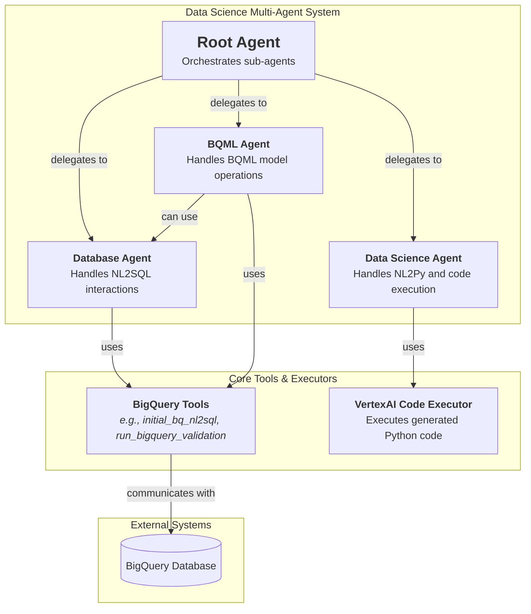

```mermaid
graph TD
    subgraph "Data Science Multi-Agent System"
        root_agent["<font size=5><b>Root Agent</b></font><br>Orchestrates sub-agents"]
        db_agent["<b>Database Agent</b><br>Handles NL2SQL interactions"]
        ds_agent["<b>Data Science Agent</b><br>Handles NL2Py and code execution"]
        bqml_agent["<b>BQML Agent</b><br>Handles BQML model operations"]
    end

    subgraph "Core Tools & Executors"
        bq_tools["<b>BigQuery Tools</b><br><i>e.g., initial_bq_nl2sql, run_bigquery_validation</i>"]
        code_executor["<b>VertexAI Code Executor</b><br>Executes generated Python code"]
    end

    subgraph "External Systems"
        bq_db[(BigQuery Database)]
    end

    root_agent -->|delegates to| db_agent;
    root_agent -->|delegates to| ds_agent;
    root_agent -->|delegates to| bqml_agent;

    db_agent -->|uses| bq_tools;
    ds_agent -->|uses| code_executor;
    bqml_agent -->|uses| bq_tools;
    bqml_agent -->|can use| db_agent; 

    bq_tools -->|communicates with| bq_db;
```
