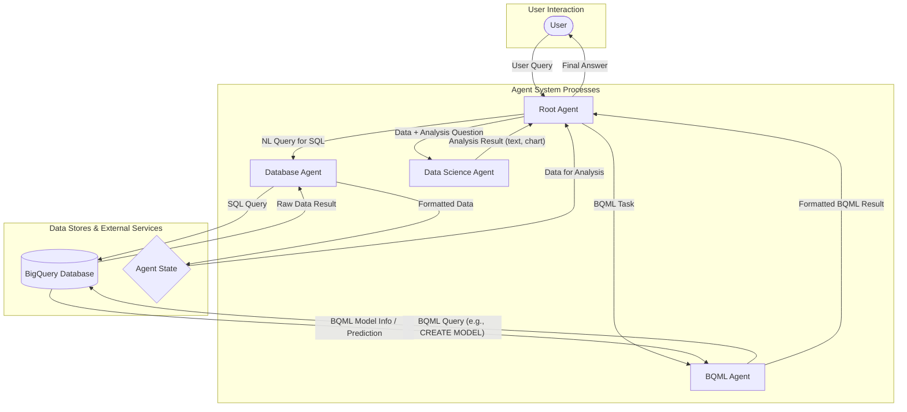

```mermaid
graph TD
    subgraph "User Interaction"
        User([User])
    end

    subgraph "Agent System Processes"
        A[Root Agent]
        B[Database Agent]
        C[Data Science Agent]
        D[BQML Agent]
    end

    subgraph "Data Stores & External Services"
        BQ_DB[(BigQuery Database)]
        StateStore{Agent State}
    end

    User -- "User Query" --> A;
    A -- "NL Query for SQL" --> B;
    B -- "SQL Query" --> BQ_DB;
    BQ_DB -- "Raw Data Result" --> B;
    B -- "Formatted Data" --> StateStore;
    StateStore -- "Data for Analysis" --> A
    A -- "Data + Analysis Question" --> C;
    C -- "Analysis Result (text, chart)" --> A;
    A -- "BQML Task" --> D;
    D -- "BQML Query (e.g., CREATE MODEL)" --> BQ_DB;
    BQ_DB -- "BQML Model Info / Prediction" --> D;
    D -- "Formatted BQML Result" --> A;
    A -- "Final Answer" --> User;
```
