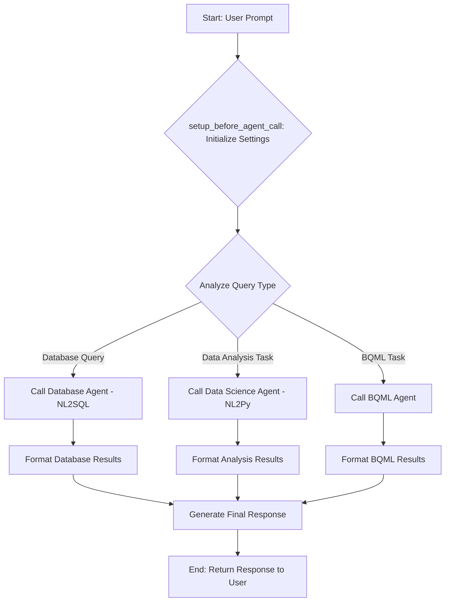

```mermaid
graph TD
    A[Start: User Prompt] --> B{setup_before_agent_call: Initialize Settings};
    B --> C{Analyze Query Type};
    C -- "Database Query" --> D[Call Database Agent - NL2SQL];
    C -- "Data Analysis Task" --> E[Call Data Science Agent - NL2Py];
    C -- "BQML Task" --> F[Call BQML Agent];
    D --> G[Format Database Results];
    E --> H[Format Analysis Results];
    F --> I[Format BQML Results];
    G --> J[Generate Final Response];
    H --> J;
    I --> J;
    J --> K[End: Return Response to User];
```
