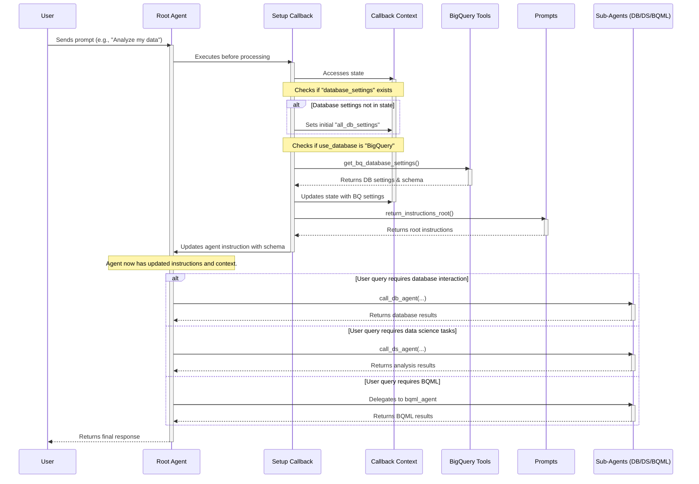

```mermaid
sequenceDiagram
    participant User
    participant root_agent as Root Agent
    participant setup_before_agent_call as Setup Callback
    participant callback_context as Callback Context
    participant bq_tools as BigQuery Tools
    participant prompts as Prompts
    participant sub_agents as Sub-Agents (DB/DS/BQML)

    User->>root_agent: Sends prompt (e.g., "Analyze my data")
    activate root_agent

    root_agent->>setup_before_agent_call: Executes before processing
    activate setup_before_agent_call

    setup_before_agent_call->>callback_context: Accesses state
    activate callback_context
    Note over setup_before_agent_call, callback_context: Checks if "database_settings" exists

    alt Database settings not in state
        setup_before_agent_call->>callback_context: Sets initial "all_db_settings"
    end

    Note over setup_before_agent_call, callback_context: Checks if use_database is "BigQuery"
    setup_before_agent_call->>bq_tools: get_bq_database_settings()
    activate bq_tools
    bq_tools-->>setup_before_agent_call: Returns DB settings & schema
    deactivate bq_tools

    setup_before_agent_call->>callback_context: Updates state with BQ settings
    deactivate callback_context

    setup_before_agent_call->>prompts: return_instructions_root()
    activate prompts
    prompts-->>setup_before_agent_call: Returns root instructions
    deactivate prompts

    setup_before_agent_call->>root_agent: Updates agent instruction with schema
    deactivate setup_before_agent_call

    Note over root_agent: Agent now has updated instructions and context.

    alt User query requires database interaction
        root_agent->>sub_agents: call_db_agent(...)
        activate sub_agents
        sub_agents-->>root_agent: Returns database results
        deactivate sub_agents
    else User query requires data science tasks
        root_agent->>sub_agents: call_ds_agent(...)
        activate sub_agents
        sub_agents-->>root_agent: Returns analysis results
        deactivate sub_agents
    else User query requires BQML
        root_agent->>sub_agents: Delegates to bqml_agent
        activate sub_agents
        sub_agents-->>root_agent: Returns BQML results
        deactivate sub_agents
    end

    root_agent-->>User: Returns final response
    deactivate root_agent
```
