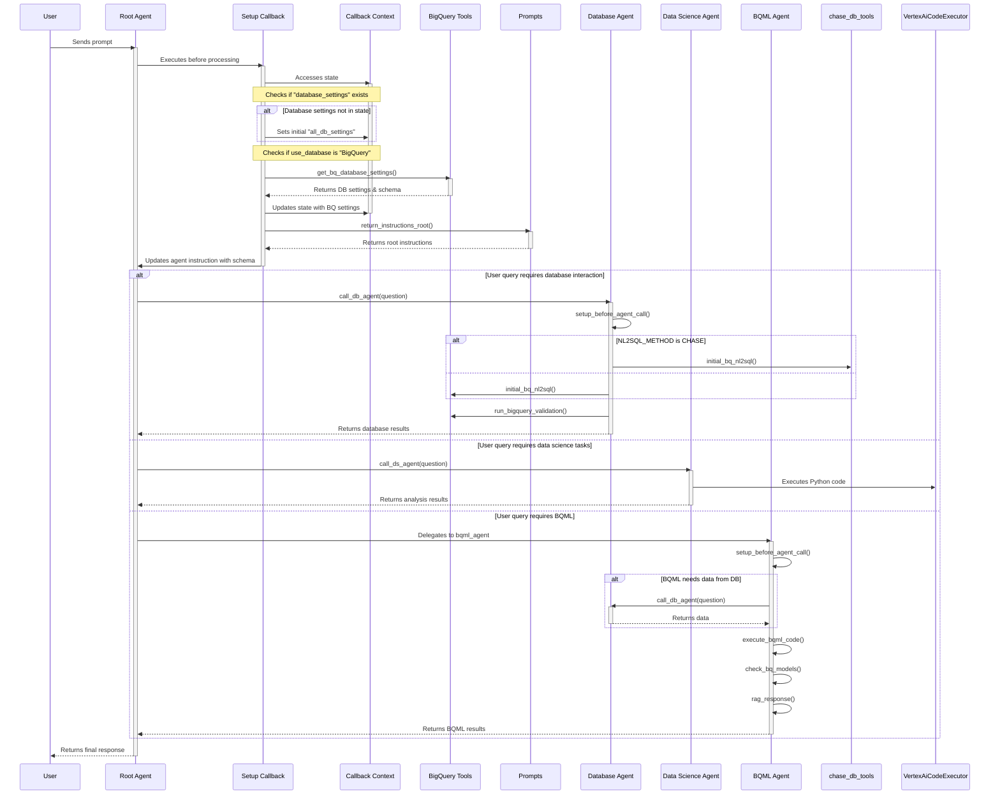

```mermaid
sequenceDiagram
    participant User
    participant root_agent as Root Agent
    participant setup_before_agent_call as Setup Callback
    participant callback_context as Callback Context
    participant bq_tools as BigQuery Tools
    participant prompts as Prompts
    participant db_agent as Database Agent
    participant ds_agent as Data Science Agent
    participant bqml_agent as BQML Agent

    User->>root_agent: Sends prompt
    activate root_agent

    root_agent->>setup_before_agent_call: Executes before processing
    activate setup_before_agent_call

    setup_before_agent_call->>callback_context: Accesses state
    activate callback_context
    Note over setup_before_agent_call, callback_context: Checks if "database_settings" exists

    alt Database settings not in state
        setup_before_agent_call->>callback_context: Sets initial "all_db_settings"
    end

    Note over setup_before_agent_call, callback_context: Checks if use_database is "BigQuery"
    setup_before_agent_call->>bq_tools: get_bq_database_settings()
    activate bq_tools
    bq_tools-->>setup_before_agent_call: Returns DB settings & schema
    deactivate bq_tools

    setup_before_agent_call->>callback_context: Updates state with BQ settings
    deactivate callback_context

    setup_before_agent_call->>prompts: return_instructions_root()
    activate prompts
    prompts-->>setup_before_agent_call: Returns root instructions
    deactivate prompts

    setup_before_agent_call->>root_agent: Updates agent instruction with schema
    deactivate setup_before_agent_call

    alt User query requires database interaction
        root_agent->>db_agent: call_db_agent(question)
        activate db_agent
        db_agent->>db_agent: setup_before_agent_call()
        alt NL2SQL_METHOD is CHASE
            db_agent->>chase_db_tools: initial_bq_nl2sql()
        else
            db_agent->>bq_tools: initial_bq_nl2sql()
        end
        db_agent->>bq_tools: run_bigquery_validation()
        db_agent-->>root_agent: Returns database results
        deactivate db_agent
    else User query requires data science tasks
        root_agent->>ds_agent: call_ds_agent(question)
        activate ds_agent
        ds_agent->>VertexAiCodeExecutor: Executes Python code
        ds_agent-->>root_agent: Returns analysis results
        deactivate ds_agent
    else User query requires BQML
        root_agent->>bqml_agent: Delegates to bqml_agent
        activate bqml_agent
        bqml_agent->>bqml_agent: setup_before_agent_call()
        alt BQML needs data from DB
            bqml_agent->>db_agent: call_db_agent(question)
            activate db_agent
            db_agent-->>bqml_agent: Returns data
            deactivate db_agent
        end
        bqml_agent->>bqml_agent: execute_bqml_code()
        bqml_agent->>bqml_agent: check_bq_models()
        bqml_agent->>bqml_agent: rag_response()
        bqml_agent-->>root_agent: Returns BQML results
        deactivate bqml_agent
    end

    root_agent-->>User: Returns final response
    deactivate root_agent
```
